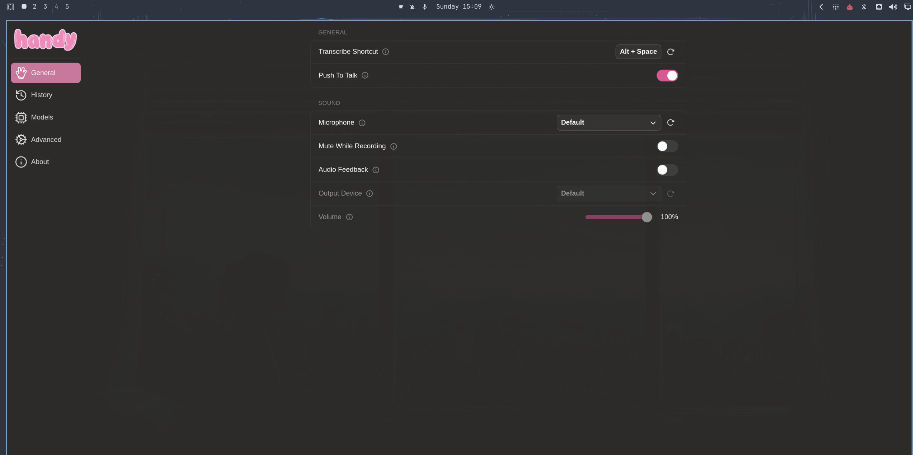

# Handy Dictation for Omarchy Quattro

`blizl.handy` is a Quattro-native bar widget and push-to-talk integration for
[Handy](https://github.com/cjpais/Handy). It keeps a dynamic microphone glyph visible,
shows capture state directly from PipeWire, provides 100% reliable kernel-level evdev
push-to-talk (`handy_keys`), and ensures clean modifier-release parity regardless of which
key in the shortcut chord is released first.



## About Handy

[Handy](https://github.com/cjpais/Handy) is a free and open-source desktop
speech-to-text application. It records speech when you press or hold a
configured shortcut, transcribes it locally with a downloaded model, and
inserts the resulting text into the application you are using. Handy works
offline, so transcription does not require sending your voice to a cloud
service.

Handy is released under the MIT License and supports Whisper and Parakeet
speech-recognition models. Handy's own interface handles model downloads,
language and transcription settings, and transcript history. This plugin adds
the Omarchy-specific Quickshell microphone indicator, push-to-talk bindings,
missing-microphone handling, and reversible setup around that upstream app.

### Supported languages

Language support depends on the model selected in Handy; this plugin does not
add or remove languages. Handy shows only the language choices supported by the
active model and offers automatic detection when that model provides it.

- Multilingual Whisper models support 99 languages. Whisper Large v3 and Large
  v3 Turbo also support Cantonese.
- Parakeet TDT 0.6B v3 supports Bulgarian, Croatian, Czech, Danish, Dutch,
  English, Estonian, Finnish, French, German, Greek, Hungarian, Italian,
  Latvian, Lithuanian, Maltese, Polish, Portuguese, Romanian, Russian, Slovak,
  Slovenian, Spanish, Swedish, and Ukrainian.
- Parakeet Unified EN and Parakeet TDT 0.6B v2 support English only.
- Other models available through Handy have their own language lists. Handy's
  model and language settings are the authoritative source for the installed
  version.

<details>
<summary>All 99 languages supported by multilingual Whisper models</summary>

English, Chinese, German, Spanish, Russian, Korean, French, Japanese,
Portuguese, Turkish, Polish, Catalan, Dutch, Arabic, Swedish, Italian,
Indonesian, Hindi, Finnish, Vietnamese, Hebrew, Ukrainian, Greek, Malay, Czech,
Romanian, Danish, Hungarian, Tamil, Norwegian, Thai, Urdu, Croatian, Bulgarian,
Lithuanian, Latin, Maori, Malayalam, Welsh, Slovak, Telugu, Persian, Latvian,
Bengali, Serbian, Azerbaijani, Slovenian, Kannada, Estonian, Macedonian, Breton,
Basque, Icelandic, Armenian, Nepali, Mongolian, Bosnian, Kazakh, Albanian,
Swahili, Galician, Marathi, Punjabi, Sinhala, Khmer, Shona, Yoruba, Somali,
Afrikaans, Occitan, Georgian, Belarusian, Tajik, Sindhi, Gujarati, Amharic,
Yiddish, Lao, Uzbek, Faroese, Haitian Creole, Pashto, Turkmen, Nynorsk, Maltese,
Sanskrit, Luxembourgish, Myanmar, Tibetan, Tagalog, Malagasy, Assamese, Tatar,
Hawaiian, Lingala, Hausa, Bashkir, Javanese, and Sundanese.

</details>

## Install

```bash
omarchy plugin add https://github.com/Blizl/Omarchy-Handy-Plugin.git --enable \
  && ~/.config/omarchy/plugins/blizl.handy/bin/setup
```

After updating an existing v1 installation, run
`~/.config/omarchy/plugins/blizl.handy/bin/setup` again. It first restores the
previous integration, then reapplies the latest conflict-safe setup so
uninstall still returns the machine to its original state.

Setup opens Handy's official onboarding for model selection. It then asks which
push-to-talk shortcut to own, configures Handy's native `handy_keys` engine with
that shortcut in push-to-talk mode, ensures kernel input device permissions, disables
VoxType's native hotkey, and unbinds all detected user and stock VoxType shortcuts in
Hyprland. If the selected Handy shortcut overlaps a VoxType shortcut, setup warns
before changing anything and requires explicit confirmation. VoxType may remain
installed, but Handy becomes Omarchy's only active dictation integration until
uninstall restores the previous controls.

Setup also replaces the built-in center Dictation indicator with Handy, then
runs an inline acceptance test directly in the active terminal that clearly
identifies Handy as the engine. It commits only when that test receives
non-empty dictated text.

If the dictation test fails or ends without text, setup restores the previous
bindings, shell layout, Handy and VoxType shortcut settings, autostart, and
process state. It then disables and removes the installed `blizl.handy` plugin,
avoiding a partially configured integration. VoxType removal is never the
default and is offered only after the dictation test succeeds.

Supported shortcut choices are a detected VoxType shortcut, `ALT + SPACE`, or a
custom Omarchy shortcut. Replacing a non-VoxType action requires confirmation.

## Widget behavior

The widget reads Quickshell's PipeWire objects; it does not tail logs or keep a
`pactl subscribe` process alive. States use this precedence:

1. microphone missing
2. microphone muted
3. Handy recording
4. another application capturing audio
5. microphone available

Left-click opens Handy when it is idle. While Handy is recording, left-click is
an emergency stop that finishes the active dictation and preserves its text. If
Handy cannot finish it, the trigger cancels the recording and sends a failure
notification. Middle-click opens Omarchy's audio panel. Clicking while no
default microphone exists sends a notification instead.

### Native evdev push-to-talk (`handy_keys`)

Push-to-talk shortcuts (such as `ALT + SPACE`, `ALT + ENTER`, `SUPER + SPACE`, or custom chords)
leverage Handy's native kernel-level evdev engine (`handy_keys`):

- **Solves Modifier Release Order Dropping**: Standard Wayland and Hyprland release bindings
  (`bindr` / `{ release = true }`) only trigger if the base key is released while all modifier keys
  are still held down. If a user naturally lets go of `Alt` a millisecond before `Space` (or vice versa),
  compositor bindings drop the release event completely, leaving the microphone running indefinitely.
  `blizl.handy` resolves this entirely: Handy's native evdev engine tracks key state directly from the
  kernel and stops recording the exact moment **either** `Alt` or `Space`/`Enter` is released.
- **Direct Kernel-Level Hotkeys**: Handy connects directly to Linux input devices (`/dev/input/event*`)
  via its native Rust `handy_keys` engine, matching Omarchy's native VoxType architecture.
- **Zero Compositor Interference**: Hyprland cleanly unbinds conflicting shortcuts (`hl.unbind(...)`) so
  compositor key grabs never swallow or intercept modifier transitions.
- **Zero Idle Wrapper Overhead**: Eliminates external wrapper scripts, timeouts, and background daemons
  for instant, 100% reliable voice typing.

## Remove the integration

### Standard Removal
To remove the plugin integration and restore all original configurations (Hyprland bindings, center indicators, autostart, and VoxType settings) while preserving Handy and downloaded models:

```bash
~/.config/omarchy/plugins/blizl.handy/bin/uninstall && omarchy plugin remove blizl.handy
```

*(When running directly from this repository checkout, use `./bin/uninstall && omarchy plugin remove blizl.handy`)*

---

### Complete Removal & Full VoxType Restoration
To completely remove the plugin and Handy, clean up downloaded model caches, and fully restore native Omarchy VoxType dictation with automated checkpoint backups:

```bash
~/.config/omarchy/plugins/blizl.handy/bin/restore-voxtype
```

* **Preserve previous custom VoxType bindings:**
  ```bash
  ~/.config/omarchy/plugins/blizl.handy/bin/restore-voxtype --yes --bindings previous
  ```
* **Restore stock Omarchy bindings (`F9` hold / `Super+Ctrl+X` toggle):**
  ```bash
  ~/.config/omarchy/plugins/blizl.handy/bin/restore-voxtype --yes --bindings stock
  ```

*(When running from a local checkout, replace the path above with `./bin/restore-voxtype`. Pass `--keep-plugin` if the checkout should stay installed after the reset, or `--keep-handy-data` to retain Handy's settings, recordings, and downloaded model caches).*

---

### Complete Purge of Handy & Speech Models
To manually remove Handy, all downloaded Whisper/Parakeet speech models, and all local configuration/databases:

```bash
# 1. Uninstall the plugin integration & restore configuration files
~/.config/omarchy/plugins/blizl.handy/bin/uninstall && omarchy plugin remove blizl.handy

# 2. Remove the Handy package
sudo pacman -R --noconfirm handy-bin handy-bin-debug 2>/dev/null || true

# 3. Remove Handy user settings, databases, and autostart files
rm -rf ~/.local/share/com.pais.handy ~/.config/autostart/Handy.desktop

# 4. Remove all downloaded speech models
rm -rf ~/.cache/huggingface/hub/models--handy-computer--*
```

## Safe end-to-end testing

Live testing must begin with a verified checkpoint:

```bash
bin/e2e-checkpoint create
bin/e2e-checkpoint verify CHECKPOINT_ID
```

The command prints the checkpoint ID and its manual recovery command. The E2E
runner restores automatically on errors, interrupts, and failed assertions:

```bash
BLIZL_HANDY_BASELINE_TEST=passed \
BLIZL_HANDY_BASELINE_INDICATOR=passed \
tests-e2e/run
```

Set those confirmations only after manually proving the existing Alt+Space
dictation and microphone indicator. The runner records baseline Hyprland errors
but does not start checkpointed live scenarios unless
`BLIZL_HANDY_E2E_LIVE=yes` is also set. Its checked-in scenarios validate the
plugin and runtime prerequisites; microphone plug/unplug, shell restart, login,
and real dictated-text checks remain guided manual acceptance steps.

Restore or discard a retained checkpoint explicitly:

```bash
bin/e2e-checkpoint restore CHECKPOINT_ID
bin/e2e-checkpoint discard CHECKPOINT_ID
```

`discard` is intentionally separate from restore. Keep the last checkpoint
until dictation, the widget, a shell restart, and a new login have all worked.

Live VoxType removal is skipped unless its exact installed package exists in
the package cache. This is what makes exact restoration possible.

## Development

Tests use temporary homes and fake system commands. They must never modify the
developer's live Omarchy configuration.

```bash
tests/run
shellcheck bin/* lib/*.sh tests/*.sh tests-e2e/run tests-e2e/verify-baseline tests-e2e/scenarios/*
shfmt -d -i 2 -ci bin/* lib/*.sh tests/*.sh tests-e2e/run tests-e2e/verify-baseline tests-e2e/scenarios/*
jq --exit-status . manifest.json
omarchy plugin validate .
git diff --check
```

`tests/run` executes every temporary-home test script. GitHub Actions runs the
same suite plus shell syntax/style, QML syntax, and manifest checks. Omarchy's
plugin validator is intentionally a local check because GitHub runners do not
ship the Omarchy shell.

The implementation deliberately separates core responsibilities:

- `HandyWidget.qml`: PipeWire state and bar interaction
- `bin/handy-trigger`: runtime emergency stop, manual toggle, and notifications
- `bin/setup` and `bin/uninstall`: reversible integration ownership and native `handy_keys` configuration
- `bin/restore-voxtype`: clean rollback and recovery to stock or previous VoxType setup
- `bin/e2e-checkpoint`: machine-level E2E recovery

Shell helpers in `lib/` contain pure detection and file-transformation logic so
the risky orchestration remains small and testable.
